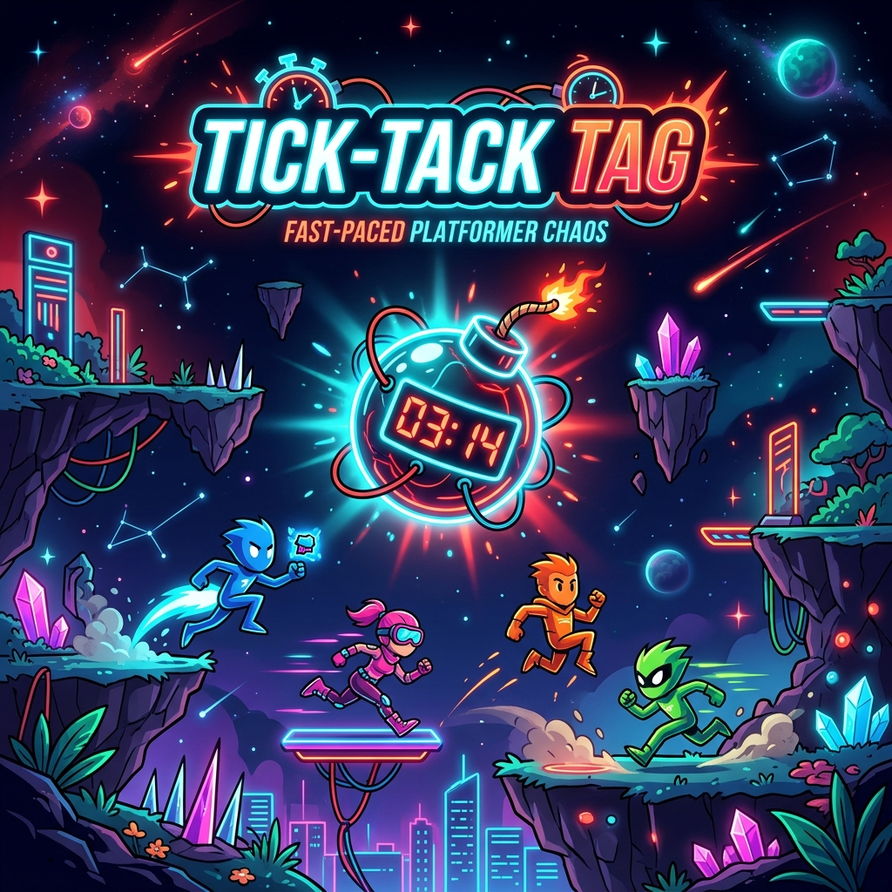

# 
🎮 Tick-Tack Tag 💣

  

  <strong>Un minijoc competitiu de plataformes en 2D que fusiona velocitat, estratègia i la clàssica mecànica de la "Patata Calenta".</strong>

  
  
  
  
  

---

## 💎 Sobre el Projecte
**Tick-Tack Tag** és una experiència multijugador full-stack on la supervivència és l'única regla. Els jugadors han de navegar per arenes dinàmiques, utilitzant escaleres i salts precisos per evitar portar la bomba quan el temporitzador arribi a zero.

> [!IMPORTANT]
> Aquest projecte és el resultat del treball transversal **TR3**, enfocat en la integració de sistemes distribuïts, IA i desenvolupat amb motor Unity.

---

## 👤 Informació del Participant
* **Nom de l'integrant:** Kim Galicio Lamar
* **Rol:** Desenvolupador Full-Stack & Game Designer
* **Projecte:** TR3 - Desenvolupament de Joc Multijugador

---

## 🚀 Característiques Principals
- **⚡ Multijugador en Temps Real:** Sistema basat en WebSockets per a una sincronització perfecta entre clients.
- **🧠 IA Evolutiva:** Bots entrenats amb **ML-Agents** que utilitzen la tècnica de *Brain Swapping* per adaptar el seu estil de joc (Perseguidor / Evasió).
- **💾 Persistència Robusta:** Backend en Node.js amb base de dades MySQL per gestionar perfils, rànquings i sessions.
- **🎨 UI Moderna:** Interfície d'usuari reactiva implementada amb **UI Toolkit (UXML/USS)**.

---

## 🛠️ Stack Tecnològic
| Component | Tecnologia |
| :--- | :--- |
| **Engine** | Unity 2022.3+ |
| **Llenguatge** | C# (Unity) / JavaScript (Backend) |
| **Backend** | Node.js, Express |
| **Base de Dades** | MySQL |
| **IA** | Unity ML-Agents |
| **Infraestructura** | Docker & Docker-Compose |

---

## 📂 Enllaços i Recursos
- 📝 **Gestor de Tasques:** [Veure Backlog i Progrés](doc/context/05_BACKLOG.md)
- 🖼️ **Disseny i Especificacions:** [Documentació OpenSpec](doc/openspec/specs/spec.md)
- 🌐 **Estat de Producció:** *Entorn de desenvolupament local / Dockeritzat*
- 🚩 **Estat Actual:** `Fase de Poliment i Optimització 🚀`

---

## 📖 Com Començar
Per a una guia detallada sobre com aixecar l'entorn de desenvolupament i desplegar el backend, consulteu el nostre **[Índex de Documentació](doc/README.md)**.

---

  <i>Creat amb ❤️ per Kim Galicio Lamar</i>

