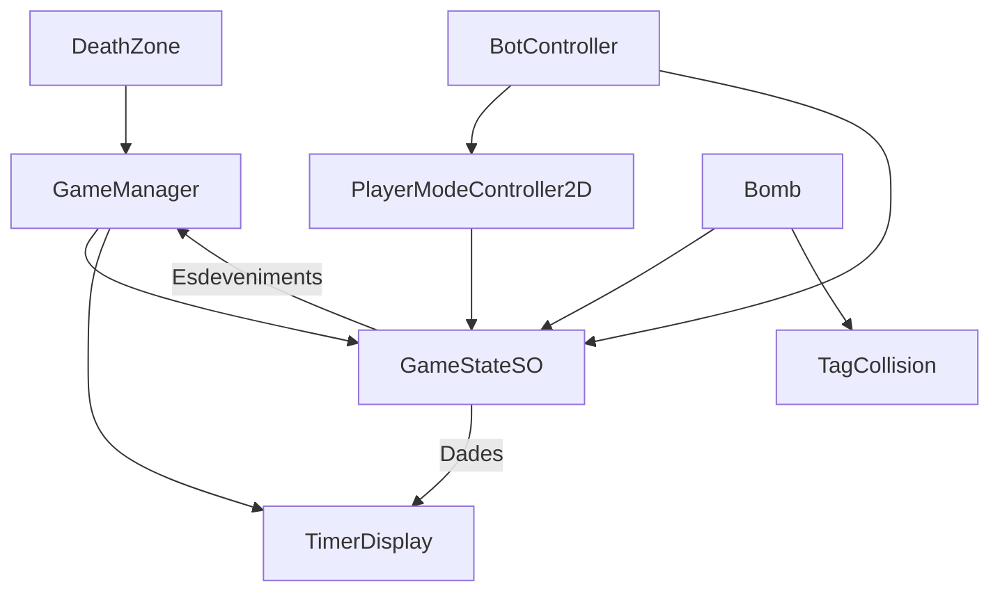

# 06_SYSTEM_MAP

## Scripts Clau i Relacions

## Descripcions

- **GameManager**: Autoritat central per a la lògica de les rondes (respawns, resta de vides).
- **GameStateSO**: El magatzem central de dades. Notifica als altres sistemes els canvis (traspàs de bomba, temporitzador, Fi de Joc).
- **Bomb**: Gestiona la lògica del temporitzador i l'esdeveniment d'explosió.
- **TagCollision**: Lògica específica per passar la bomba entre col·lididors tipus "trigger".
- **PlayerModeController2D**: Gestiona les físiques, el moviment i les animacions. Rep inputs del teclat o del `BotController`.
- **BotController**: Capa de sensors/actuadors de ML-Agents.
- **DeathZone**: Activa la lògica de mort quan les entitats cauen fora dels límits.
