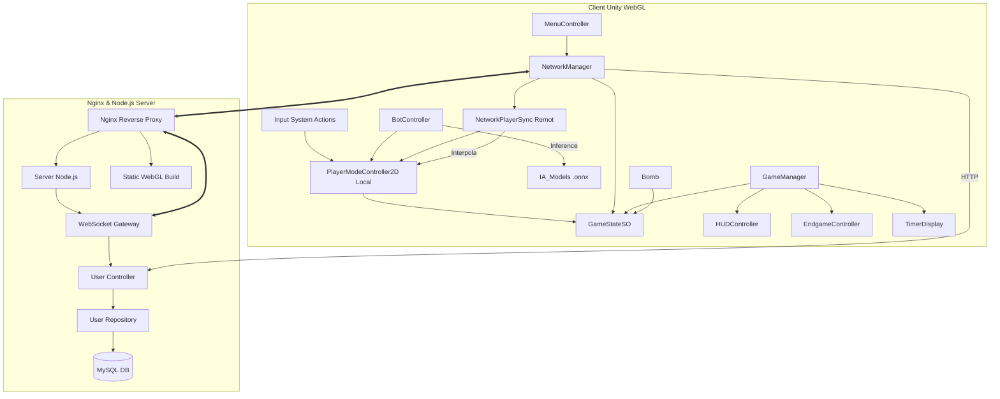

# 06_SYSTEM_MAP

## Scripts Clau i Relacions

## Descripcions

- **NetworkManager**: Punt d'entrada per a tota la comunicació externa (HTTP/WS). Sincronitza l'estat remot, gestiona errors de xarxa i delega la instanciació de components com `NetworkPlayerSync`.
- **NetworkPlayerSync**: Adjuntat als jugadors remots (en comptes del sistema d'inputs locals). Fa d'intermediari entre els esdeveniments WebSocket i l'Animator i Rigidbody (marcat com a Cinemàtic).
- **GameStateSO**: El magatzem central de dades local. Notifica a la UI i als controladors els canvis d'estat de forma desacoblada.
- **Backend Server (Nginx + Node.js)**: Nginx serveix els fitxers WebGL per a navegadors i fa proxy per a l'API Node.js i WebSockets. El servidor gestiona multijugador, cua i abandons.
- **GameManager**: Autoritat per a la lògica de joc local i la coordinació dels agents. Decideix quan cridar al HUD (inici de ronda) o l'EndgameController (victòria/derrota/abandó).
- **UI Toolkit Controllers**: 
  - `MenuController`: Gestiona Login i selecció.
  - `HUDController`: Mostra text in-game ("Comença la Ronda 1").
  - `EndgameController`: Pantalles de resultats.
- **BotController**: IA que utilitza "Brain Swapping" per decidir si perseguir o fugir basant-se en l'estat de la bomba al `GameStateSO` (útil en mode VS_BOT).
