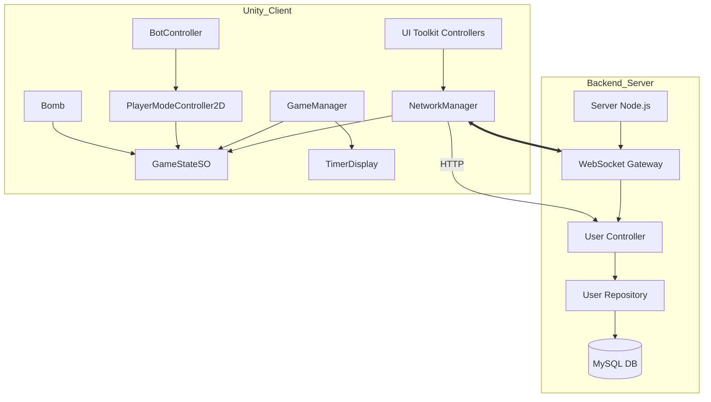

# 06_SYSTEM_MAP

## Scripts Clau i Relacions

## Descripcions

- **NetworkManager**: Punt d'entrada per a tota la comunicació externa (HTTP/WS). Sincronitza l'estat remot amb el `GameStateSO`.
- **GameStateSO**: El magatzem central de dades local. Notifica a la UI i als controladors els canvis d'estat.
- **Backend Server**: Gestiona la lògica de partides multijugador, l'autenticació i la persistència.
- **GameManager**: Autoritat per a la lògica de joc local i la coordinació dels agents.
- **UI Toolkit Controllers**: Gestionen la interacció de l'usuari en els menús i pantalles de resultat, comunicant-se amb el `NetworkManager`.
- **BotController**: IA que utilitza "Brain Swapping" per decidir si perseguir o fugir basant-se en l'estat de la bomba al `GameStateSO`.

